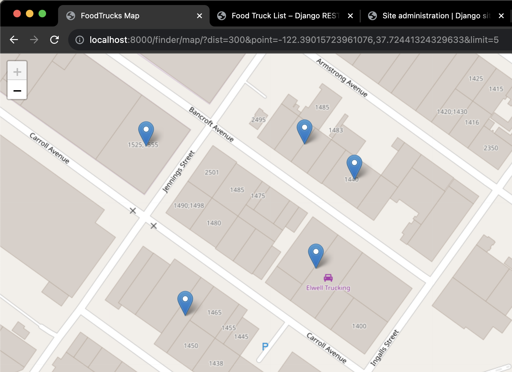

# Assessment: World Needs More Food Trucks

An assessment the for RAKT Engineering Challenge as part of my application for the Senior Django Developer role at RAKT Innovations.

This is a Python/Django containerized project that setups and loads the CSV data on the database on start. Please check the file [foodtruck_from_csv.py](./django_food_truck/finder/management/commands/foodtruck_from_csv.py) to see the data load code.

After the container initialization please wait until the server completes loads.

<br>
**MAP URL:** http://localhost:8000/finder/map/?dist=300&point=-122.39015723961076,37.72441324329633&limit=5

More Details on [ASSIGNMENT.md](./ASSIGNMENT.md)

## Getting Started

## Dependencies

* Docker
* PostgreSQL
* Python
* Packages:
  * **Django**
  * More Details on [requirements.txt](django_food_truck/requirements.txt)

## Installing

> Do you have [Docker Installed](https://www.docker.com/)?

## Building and Running Development environment (DEV)

* ### BUILD AND RUN - using make
  
  If make is installed you can use the following command:

  ````commandline
  make dev
  ````

But if you don't have make installed follow the below steps:

* ### BUILD & RUN - without make
  
  ````commandline  
  docker-compose build --no-cache
  docker-compose up -d
  ````

* ### OPEN <http://localhost:8000/> - On open will be redirected to the Map showing food truck locations.

* ### FOOD TRUCK MAP
  
  ```comment
  url: http://localhost:8000/finder/map/?dist=300&point=-122.39015723961076,37.72441324329633&limit=5
  ```

* ### FOOD TRUCK DJANGO REST FRAMEWORK ENDPOINT
  
  ```comment
  url: http://localhost:8000/api/v1/food-truck/?dist=300&point=-122.39015723961076,37.72441324329633&limit=5
  ```

* ### SUPER USER & DJANGO ADMIN
  
  ```comment
  username: superuser
  password: password
  
  admin url: http://localhost:8000/admin
  ```

## Help: If you have any problem please e-mail me or contact me on LinkedIn.

Note that maybe you will need to give execution permission to the file [entrypoint.sh](./django_food_truck/entrypoint.sh) - navigate to the folder. The explanation is that this is a development environment and the local files are mounted in the docker container.

```bash
chdmod +x ./entrypoint.sh
```

## Author: Marco Maschio

### [Linkedin](https://linkedin.com/in/marcoantonioms) | [My Links](https://linktr.ee/marco_maschio)

Thank you for your time, and I hope we can talk soon.
